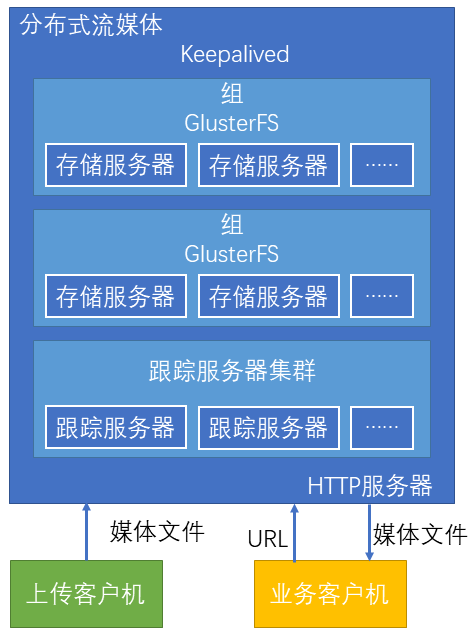
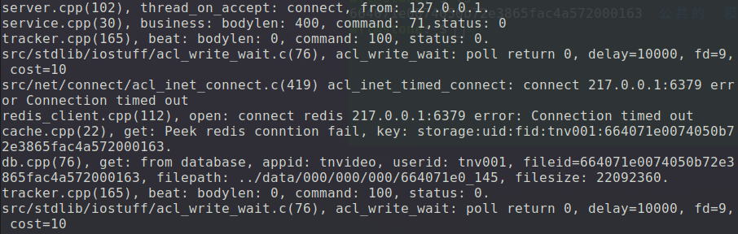

# 分布式流媒体服务器

分布式存储主要分为三个系统：容灾系统，存储系统，仲裁系统

+ 容灾系统：相互备份和热切换 
+ 存储系统：实际存储文件内容
+ 仲裁系统：由算法确定文件存储位置


分布式流媒体主要分为：

+ **Keepalived**：在多台存储服务器和多台跟踪服务器之间实现热切换
+ **组**：内容对等的存储服务器集合，其文件系统通过GlusterFS实时同步
+ **存储服务器**：实际存储流媒体文件的服务器，同组存储服务器互为备份
+ **跟踪服务器集群**：由多台跟踪服务器组成的集群，互为热备，负载均衡



这里的`跟踪服务器`其实就是`仲裁系统`，它跟踪的其实就是存储服务器状态。`Keepalived`就是`容灾系统`，它是用来保证系统处于可用的活动状态。

> 疑问：为什么要用分布式流媒体？

    答：在单机情况下为了文件资源管理的问题，包括空间容量，所服务的用户数量等。当资源持续性增大，并采用分布式的方式：有跟踪系统，存储系统，容灾系统用来解决：高响应性问题，高可用性问题、高扩展性问题。

    用跟踪服务器来实时汇总服务器的运行状态信息，用多台服务器能互相分摊负载，同时互为备份，保证了高响应性和高可用性，用专用客户端来维护存储服务器上的资源，对文件作增删改查等各项操作，同时监控服务器的运行状态。用内部的私有协议转化为外部的Http协议配合Http客户端来做web流媒体服务器。

## 系统整体结构


+ 跟踪服务器：跟踪服务器负责管理所有存储服务器和组。每台存储服务器启动后，都会与跟踪服务器建立连接，向其通告自己所隶属的组，并保持周期性心跳。
跟踪服务器据此维护组——存储服务器映射表。

> 简单理解：跟踪服务器用来汇总并记录存储服务器的运行状态，并在用户发出请求的时候，响应客户机存储服务器的可用信息，用户去使用可用的存储服务器。

+ ID服务器：用来提供唯一性id的，用来标识不同的资源。

> 主要是为了解决在分布式系统中，产生唯一的ID，避免出现相同的ID的情况。

+ 存储服务器：用来存储流媒体资源。

+ 客户机：提供上传、删除等针对存储服务器内容的管理和维护功能。

> 主要是为管理员，提供相应的接口，供管理员操作的。

+ HTTP服务器：内置的Web Server，支持基于HTTP的流媒体下载和播放。

+ HTTP客户机：支持HTTP协议的流媒体播放器。

> 普通用户所操作的软件

## 报文规约

所有的报文格式都遵循：`定长包头，变长包体`的形式

### 跟踪服务器通信报文

#### 存储服务器向跟踪服务器请求加入

##### 请求报文

<table>
    <tr align="center">
  		 <td colspan="3">包头</td> 
      	 <td colspan="6">包体</td>    
    </tr>
    <tr align="center">
        <td>包体长度</td> 
        <td>命令（10）</td>  
        <td>状态</td>
        <td>版本</td> 
        <td>组名</td>  
        <td>主机名</td> 
        <td>端口号</td> 
        <td>启动时间</td>  
        <td>加入时间</td> 
    </tr>
    <tr align="center">
        <td>8</td> 
        <td>1</td>  
        <td>1</td>
        <td align="center" colspan="6">包体长度</td> 
    </tr>
</table>

这里命令中若是`10`，则表示：`存储服务器向跟踪服务器请求加入`，后面所有的包体长度一共有8个字节。`存储服务器向跟踪服务器请求加入`表示当存储服务器启动之后，要向跟踪服务器发送消息，表示自己正常，可以存储数据了。

##### 成功响应

<table>
    <tr align="center">
  		 <td colspan="3">包头</td> 
    </tr>
    <tr align="center">
        <td>包体长度</td> 
        <td>命令（100）</td>  
        <td>状态</td>
    </tr>
    <tr align="center">
        <td>8</td> 
        <td>1</td>  
        <td>1</td>
    </tr>
</table>

##### 失败响应

<table>
    <tr align="center">
  		 <td colspan="3">包头</td> 
  		 <td colspan="2">包体</td> 
    </tr>
    <tr align="center">
        <td>包体长度</td> 
        <td>命令（100）</td>  
        <td>状态</td>
        <td>错误号</td>  
        <td>错误描述</td>
    </tr>
    <tr align="center">
        <td>8</td> 
        <td>1</td>  
        <td>1</td>
        <td>2</td>  
        <td><=1024</td>
    </tr>
</table>

这里的命令状态为`100`表示此命令是从`跟踪服务器`过来的（因为网络中会有各种各样的服务器，如跟踪服务器、存储服务器、ID服务器，此时收到的消息我要知道是谁发送过来的），这是信息源。

对于请求报文来说，状态没有实际的意义；对于响应报文来说，状态为`0`表示`成功响应`，状态为`非0`表示`失败响应`。

`错误号`表示`什么类型的错误`，像Http中的错误一样，400表示...，500表示...

#### 存储服务器向跟踪服务器发送心跳

##### 请求报文

<table>
    <tr align="center">
  		 <td colspan="3">包头</td> 
      	 <td colspan="6">包体</td>    
    </tr>
    <tr align="center">
        <td>包体长度</td> 
        <td>命令（11）</td>  
        <td>状态</td>
        <td>组名</td>  
        <td>主机名</td> 
    </tr>
    <tr align="center">
        <td>8</td> 
        <td>1</td>  
        <td>1</td>
        <td align="center" colspan="2">包体长度</td> 
    </tr>
</table>

##### 成功响应

<table>
    <tr align="center">
  		 <td colspan="3">包头</td> 
    </tr>
    <tr align="center">
        <td>包体长度</td> 
        <td>命令（100）</td>  
        <td>状态</td>
    </tr>
    <tr align="center">
        <td>8</td> 
        <td>1</td>  
        <td>1</td>
    </tr>
</table>

##### 失败响应

<table>
    <tr align="center">
  		 <td colspan="3">包头</td> 
  		 <td colspan="2">包体</td> 
    </tr>
    <tr align="center">
        <td>包体长度</td> 
        <td>命令（100）</td>  
        <td>状态</td>
        <td>错误号</td>  
        <td>错误描述</td>
    </tr>
    <tr align="center">
        <td>8</td> 
        <td>1</td>  
        <td>1</td>
        <td>2</td>  
        <td><=1024</td>
    </tr>
</table>

***注意***：`心跳是由存储服务器向跟踪服务器发送的`。跟踪服务器会对定期发送心跳的存储服务器更新最近一次心跳的状态，若是长时间不发送则表示存储服务器已经离线（不可用）。

#### 客户机从跟踪服务器获取存储服务器地址列表

##### 请求报文

<table>
    <tr align="center">
  		 <td colspan="3">包头</td> 
      	 <td colspan="6">包体</td>    
    </tr>
    <tr align="center">
        <td>包体长度</td> 
        <td>命令（12）</td>  
        <td>状态</td>
        <td>应用ID</td>  
        <td>用户ID</td> 
        <td>文件ID</td>  
    </tr>
    <tr align="center">
        <td>8</td> 
        <td>1</td>  
        <td>1</td>
        <td>16</td> 
        <td>256</td>  
        <td>128</td>
    </tr>
</table>

##### 成功响应

<table>
    <tr align="center">
  		 <td colspan="3">包头</td> 
  		 <td colspan="2">包体</td> 
    </tr>
    <tr align="center">
        <td>包体长度</td> 
        <td>命令（100）</td>  
        <td>状态</td>
        <td>组名</td>  
        <td>存储服务器地址列表</td>
    </tr>
    <tr align="center">
        <td>8</td> 
        <td>1</td>  
        <td>1</td> 
        <td colspan="2">包体长度</td>
    </tr>
</table>

##### 失败响应

<table>
    <tr align="center">
  		 <td colspan="3">包头</td> 
  		 <td colspan="2">包体</td> 
    </tr>
    <tr>
        <td>包体长度</td> 
        <td>命令（100）</td>  
        <td>状态</td>
        <td>错误号</td>  
        <td>错误描述</td>
    </tr>
    <tr>
        <td>8</td> 
        <td>1</td>  
        <td>1</td>
        <td>2</td>  
        <td><=1024</td>
    </tr>
</table>

在整个分布式系统中，所有的存储服务器状态信息只有跟踪服务器知道，所以客户端只能从跟踪服务器获得。

+ `应用ID`表示：想要使用哪一种应用，这里的指的是`流媒体应用`，未来可以扩展到更多的应用。

+ `用户ID`表示：当前是谁在操作这个`应用`，一般指的是管理员用户。

+ `文件ID`表示：表示想要操作的资源是哪一个，如上传、下载、删除等。

#### 客户机从跟踪服务器获取组列表

##### 请求报文

<table>
    <tr align="center">
  		 <td colspan="3">包头</td>  
    </tr>
    <tr align="center">
        <td>包体长度</td> 
        <td>命令（13）</td>  
        <td>状态</td>
    </tr>
    <tr align="center">
        <td>8</td> 
        <td>1</td>  
        <td>1</td>
    </tr>
</table>

##### 成功响应

<table>
    <tr align="center">
  		 <td colspan="3">包头</td> 
  		 <td>包体</td> 
    </tr>
    <tr align="center">
        <td>包体长度</td> 
        <td>命令（100）</td>  
        <td>状态</td>
        <td>组列表</td>  
    </tr>
    <tr align="center">
        <td>8</td> 
        <td>1</td>  
        <td>1</td> 
        <td colspan="2">包体长度</td>
    </tr>
</table>

##### 失败响应

<table>
    <tr align="center">
  		 <td colspan="3">包头</td> 
  		 <td colspan="2">包体</td> 
    </tr>
    <tr>
        <td>包体长度</td> 
        <td>命令（100）</td>  
        <td>状态</td>
        <td>错误号</td>  
        <td>错误描述</td>
    </tr>
    <tr>
        <td>8</td> 
        <td>1</td>  
        <td>1</td>
        <td>2</td>  
        <td><=1024</td>
    </tr>
</table>

这个操作主要是管理员想要查看当前组的运行状态，是用来查询所有组的信息，所以没有包体信息。

#### 总结

以上四个信息：**存储服务器向跟踪服务器请求加入**、**存储服务器向跟踪服务器发送心跳**、**客户机从跟踪服务器获取存储服务器地址列表**、**客户机从跟踪服务器获取组列表**都是`跟踪服务器`来处理的。

### ID服务器通信报文

ID服务器主要是为了生成不同的ID号，用以保证每一个文件的ID都是不重复的。每一个不同类型的数据ID可以是相同的，但是相同的数据ID一定是不同的。

#### 存储服务器从ID服务器获取ID

##### 请求报文

<table>
    <tr align="center">
  		 <td colspan="3">包头</td>  
  		 <td>包体</td>  
    </tr>
    <tr align="center">
        <td>包体长度</td> 
        <td>命令（40）</td>  
        <td>状态</td>
        <td>ID键</td>  
    </tr>
    <tr align="center">
        <td>8</td> 
        <td>1</td>  
        <td>1</td>
        <td>64+1</td>
    </tr>
</table>

##### 成功响应

<table>
    <tr align="center">
  		 <td colspan="3">包头</td> 
  		 <td>包体</td> 
    </tr>
    <tr align="center">
        <td>包体长度</td> 
        <td>命令（101）</td>  
        <td>状态</td>  
        <td>ID值</td>
    </tr>
    <tr align="center">
        <td>8</td> 
        <td>1</td>  
        <td>1</td> 
        <td>8</td> 
    </tr>
</table>

##### 失败响应

<table>
    <tr align="center">
  		 <td colspan="3">包头</td> 
  		 <td colspan="2">包体</td> 
    </tr>
    <tr>
        <td>包体长度</td> 
        <td>命令（101）</td>  
        <td>状态</td>
        <td>错误号</td>  
        <td>错误描述</td>
    </tr>
    <tr>
        <td>8</td> 
        <td>1</td>  
        <td>1</td>
        <td>2</td>  
        <td><=1024</td>
    </tr>
</table>

存储服务器去确定文件的存储路径的时候会向ID服务器发送报文，因为ID服务器生成的ID会保留文件存储路径的信息。

### 存储服务器通信报文

#### 客户机向存储服务器上传文件

##### 请求报文

<table>
    <tr align="center">
  		 <td colspan="3">包头</td>  
  		 <td colspan="5">包体</td>  
    </tr>
    <tr align="center">
        <td>包体长度</td> 
        <td>命令（70）</td>  
        <td>状态</td>
        <td>应用ID</td>  
        <td>用户ID</td> 
        <td>文件ID</td>  
        <td>文件大小</td> 
        <td>文件内容</td>     
    </tr>
    <tr align="center">
        <td>8</td> 
        <td>1</td>  
        <td>1</td>
        <td>16</td> 
        <td>256</td>  
        <td>128</td>
        <td>8</td>
        <td>文件大小</td>
    </tr>
</table>

##### 成功响应

<table>
    <tr align="center">
  		 <td colspan="3">包头</td> 
    </tr>
    <tr align="center">
        <td>包体长度</td> 
        <td>命令（102）</td>  
        <td>状态</td>  
    </tr>
    <tr align="center">
        <td>8</td> 
        <td>1</td>  
        <td>1</td>
    </tr>
</table>

##### 失败响应

<table>
    <tr align="center">
  		 <td colspan="3">包头</td> 
  		 <td colspan="2">包体</td> 
    </tr>
    <tr>
        <td>包体长度</td> 
        <td>命令（102）</td>  
        <td>状态</td>
        <td>错误号</td>  
        <td>错误描述</td>
    </tr>
    <tr>
        <td>8</td> 
        <td>1</td>  
        <td>1</td>
        <td>2</td>  
        <td><=1024</td>
    </tr>
</table>

请求报文表示哪一个应用的用户对哪一个文件上传了文件，文件大小与内容分别是什么。

#### 客户机向存储服务器询问文件大小

##### 请求报文

<table>
    <tr align="center">
  		 <td colspan="3">包头</td>  
  		 <td colspan="3">包体</td>  
    </tr>
    <tr align="center">
        <td>包体长度</td> 
        <td>命令（71）</td>  
        <td>状态</td>
        <td>应用ID</td>  
        <td>用户ID</td> 
        <td>文件ID</td>   
    </tr>
    <tr align="center">
        <td>8</td> 
        <td>1</td>  
        <td>1</td>
        <td>16</td> 
        <td>256</td>  
        <td>128</td>
    </tr>
</table>

##### 成功响应

<table>
    <tr align="center">
  		 <td colspan="3">包头</td> 
  		 <td>包体</td> 
    </tr>
    <tr align="center">
        <td>包体长度</td> 
        <td>命令（102）</td>  
        <td>状态</td>    
        <td>文件大小</td>  
    </tr>
    <tr align="center">
        <td>8</td> 
        <td>1</td>  
        <td>1</td>
        <td>8</td> 
    </tr>
</table>

##### 失败响应

<table>
    <tr align="center">
  		 <td colspan="3">包头</td> 
  		 <td colspan="2">包体</td> 
    </tr>
    <tr>
        <td>包体长度</td> 
        <td>命令（102）</td>  
        <td>状态</td>
        <td>错误号</td>  
        <td>错误描述</td>
    </tr>
    <tr>
        <td>8</td> 
        <td>1</td>  
        <td>1</td>
        <td>2</td>  
        <td><=1024</td>
    </tr>
</table>

查询的目的其实是为了下载，要知道文件大小，保证磁盘空间够不够等。

#### 客户机向存储服务器下载文件

##### 请求报文

<table>
    <tr align="center">
  		 <td colspan="3">包头</td>  
  		 <td colspan="5">包体</td>  
    </tr>
    <tr align="center">
        <td>包体长度</td> 
        <td>命令（72）</td>  
        <td>状态</td>
        <td>应用ID</td>  
        <td>用户ID</td> 
        <td>文件ID</td>   
        <td>偏移</td> 
        <td>大小</td>   
    </tr>
    <tr align="center">
        <td>8</td> 
        <td>1</td>  
        <td>1</td>
        <td>16</td> 
        <td>256</td>  
        <td>128</td>
        <td>8</td>  
        <td>8</td>
    </tr>
</table>

##### 成功响应

<table>
    <tr align="center">
  		 <td colspan="3">包头</td> 
  		 <td>包体</td> 
    </tr>
    <tr align="center">
        <td>包体长度</td> 
        <td>命令（102）</td>  
        <td>状态</td>    
        <td>文件内容</td>  
    </tr>
    <tr align="center">
        <td>8</td> 
        <td>1</td>  
        <td>1</td>
        <td>大小</td> 
    </tr>
</table>

##### 失败响应

<table>
    <tr align="center">
  		 <td colspan="3">包头</td> 
  		 <td colspan="2">包体</td> 
    </tr>
    <tr>
        <td>包体长度</td> 
        <td>命令（102）</td>  
        <td>状态</td>
        <td>错误号</td>  
        <td>错误描述</td>
    </tr>
    <tr>
        <td>8</td> 
        <td>1</td>  
        <td>1</td>
        <td>2</td>  
        <td><=1024</td>
    </tr>
</table>

下载文件，其实是用流媒体来播放的，这个过程其实是`边放边下载`的，所以我们要存储当前视频流偏移的大小。这是不断请求的过程。

#### 客户机要求删除存储服务器上的文件

##### 请求报文

<table>
    <tr align="center">
  		 <td colspan="3">包头</td>  
  		 <td colspan="5">包体</td>  
    </tr>
    <tr align="center">
        <td>包体长度</td> 
        <td>命令（73）</td>  
        <td>状态</td>
        <td>应用ID</td>  
        <td>用户ID</td> 
        <td>文件ID</td>  
    </tr>
    <tr align="center">
        <td>8</td> 
        <td>1</td>  
        <td>1</td>
        <td>16</td> 
        <td>256</td>  
        <td>128</td>
    </tr>
</table>

##### 成功响应

<table>
    <tr align="center">
  		 <td colspan="3">包头</td>
    </tr>
    <tr align="center">
        <td>包体长度</td> 
        <td>命令（102）</td>  
        <td>状态</td> 
    </tr>
    <tr align="center">
        <td>8</td> 
        <td>1</td>  
        <td>1</td>
    </tr>
</table>

##### 失败响应

<table>
    <tr align="center">
  		 <td colspan="3">包头</td> 
  		 <td colspan="2">包体</td> 
    </tr>
    <tr>
        <td>包体长度</td> 
        <td>命令（102）</td>  
        <td>状态</td>
        <td>错误号</td>  
        <td>错误描述</td>
    </tr>
    <tr>
        <td>8</td> 
        <td>1</td>  
        <td>1</td>
        <td>2</td>  
        <td><=1024</td>
    </tr>
</table>

删除文件，其实就是将磁盘上的文件删除，并将数据库中的记录也删除，这是真的删除，不是将文件做一个标记。

### 总计报文规约


所有的这些信息组合在一起，其实常用的分布式场景。如服务注册，就是程序启动之后跟踪服务器能监控存储服务器的状态，服务发现是客户端发送请求时，能根据请求信息给出相应信息等。

## 数据库

一共由三个数据库：tnv_trackerdb、tnv_idsdb、tnv_storagedb

> 疑问：为什么要创建三个数据库而不是一个数据库创建所有的数据库表？

    答：分布式情况下，不同的服务器会运行不同程序，采用这种创建不同的数据库的方式能有效减少数据冗余，降低数据库压力。

+ tnv_trackerdb
    + t_group_info
    + t_router
+ tnv_idsdb
    + t_id_gen
+ tnv_storagedb（以下三个表中的字段都是一样的，只是采用了分表的策略）
    + t_file_01
    + t_file_02
    + t_file_03

> 疑问：为什么要采用分表的策略？

    答：主要是为了防止访问数据库时性能的下降，当有大量读写数据库操作时，不同的表可以均摊压力。分成不同的表时，对数据以均等的概率存在不同的数据库表中。

> 负载均衡的理解？

    答：这里不仅仅是服务器的负载均衡，还有文件系统、CPU、数据库的负载均衡，这里数据库采用散列的方式来插入数据，保证数据均衡的分布在不同的数据库中。

### 组信息表：t_group_info

|id|group_name|create_time|updata_time|
|--|--|--|--|
|1|group001|2024-04-24 23:23:34|2024-04-24 23:23:34|

+ t_groups_info表中记录了`全部可用的组名`，在存储服务器的配置文件中指明
该存储服务器所隶属的组，其名称必含在此表之中。

> 主要是记录数据的可用组名，所有的用户都会绑定对应的组名，当组出现了问题，只会影响一部分用户，而不是所有的用户。从而保证了系统的可用性。

### 组路由表：t_router

|id|appid|userid|group_name|create_time|update_time|
|--|--|--|--|--|--|
|1|tnvideo|tnv001|group001|2024-04-24 23:23:34|2024-04-24 23:23:34|

+ 跟踪服务器在处理来自客户机的，获取存储服务器地址列表的请求时，先查
询t_router表，根据用户ID(userid)获取其对应的组名(group_name)，再于
该组中查找处于活动状态的存储服务器
+ 若t_router表中没有与该用户对应的组，则从t_groups_info表中获取全部组
名，随机抽取一个，分配给该用户，并记入t_router表

> 用户id与组id建立的关系是通过`组路由表`，将来为组里的用户来进行操作时，在特定组中的服务器会为这个用户服务，如`group001`会为`tnv001`服务，当用户查找存储服务器时，`group001`会为其查找存储服务器。

### ID生成表： t_id_gen

|id|id_value|create_time|update_time|
|--|--|--|--|
|../data|100|2024-04-24 23:23:34|2024-04-24 23:23:34|

> 注意：这里采用父目录来做键，用值来生成相应的子目录。只要保证每一次值是唯一的，就能保证父目录不同。

ID服务器采用键(id)值(id_value)对的形式管理保存在每个存储路径下的文件的ID号。该ID号将参与生成文件在存储路径下的各级子目录和文件名，比如：


../data/000/000/000/5F6E7AD2_000  
^^^^|^^^|^^|^^^|^^^^^^|^^^   
&emsp; |&emsp;  \\___________________________/   
存储路径&emsp;&emsp; 5F6E7AD2表示时间戳&emsp;&emsp;源自ID服务器生成的文件ID

针对与每个键相对应的ID值， ID服务器采取内存累加，数据库步进的方式，兼顾唯一性和效率。

> 疑问：如何保障我每次都去取这个值并更新这个值，数据库仍然能高效呢？

    答：要兼顾高效与持久化，不能只存在内存的map中，因为断电不能很好的保存数据。
    正确的方式是：在内存中去做小尺度的跟进，在数据库中去做大尺度的跟进。我在更改数据库的时候先在内存中做一个小尺度的累加，当累加到一定程度的时候再向数据库中写入。(就是上面的那一句话)

这里的文件ID大小为2^512，分成四个部分，表示：三级子目录+文件名的后缀

### 文件信息表： t_file_xx

|id|appid|userid|status|file_path|file_size|create_time|update_time|
|--|--|--|--|--|--|--|--|
|5f9e3fa7085e5aa25387c8cf7b5f29000117|tnvideo|tnv001|0|../data/000/000/000/5F6E7AD2_000|7234567321|2024-04-24 23:23:34|2024-04-24 23:23:34|

+ t_file_xx表记录了文件ID(id)和路径(file_path)及大小(file_size)的对应关系。
+ 此文件ID`并非由ID服务器生成`，而是由客户端提供的用于访问该文件的标识。这里的ID是由`雪花算法`来生成的：通过将时间戳、机器ID和序列号组合生成唯一ID。

#### 雪花算法

为了保证其唯一性，在算法中包含了用户ID、进程ID、线程ID、时间戳、计数值和随机量等信息。

用户ID&emsp; 进程ID&emsp; 线程ID&emsp; 随机数  
\\\___________________________________/    
&emsp;&emsp;&emsp;&emsp;&emsp;&emsp;&emsp;&emsp;|&emsp;&emsp;MD5   
&emsp;时间戳 &emsp;数字摘要&emsp; 计数值&emsp; 随机数  
&emsp;&emsp;\\___________________________________/  
&emsp;&emsp;&emsp;&emsp;&emsp;&emsp;&emsp;&emsp;|  
&emsp;&emsp;&emsp;&emsp;&emsp;&emsp;&emsp;文件ID

不同用户上传的文件会被记录在不同的表中，表名的最后两个字符(xx)，由用户ID的哈希值计算得到： `t_file_01`、 `t_file_02`和`t_file_03`

## 开发环境

+ Ubuntu 2020.04
+ TCL
    + Redis需要Tcl(建议使用老版本)

    ```shell
    wget http://downloads.sourceforge.net/tcl/tcl8.6.1-src.tar.gz
    tar xzvf tcl8.6.1-src.tar.gz
    cd tcl8.6.1/unix
    ./configure
    make
    sudo make install
    ```
+ Redis

    + 安装
    ```shell
    wget http://download.redis.io/redis-stable.tar.gz
    tar xzf redis-stable.tar.gz
    cd redis-stable
    make
    make test
    sudo make install
    ```

    + 修改内核参数
    ```shell
    sudo vi /etc/sysctl.conf
    vm.overcommit_memory = 1
    net.core.somaxconn = 511
    ```

    + 复制并修改Redis配置文件

    ```shell
    sudo mkdir -p /etc/redis
    sudo mkdir -p /var/redis/6379
    sudo cp redis.conf /etc/redis/6379.conf
    sudo vi /etc/redis/6379.conf

    daemonize yes
    dir /var/redis/6379
    ```

    + 将Redis配置为系统服务并启动

    ```shell
    sudo cp utils/redis_init_script /etc/init.d/redis_6379
    sudo vi /etc/init.d/redis_6379
    ### BEGIN INIT INFO
    # Provides: redis_6379
    # Required-Start:
    # Required-Stop:
    # Default-Start: 2 3 4 5
    # Default-Stop: 0 1 6
    # Short-Description: Redis data structure server
    # Description: Redis data structure server. See https://redis.io
    ### END INIT INFO
    sudo update-rc.d redis_6379 defaults
    sudo /etc/init.d/redis_
    ```
+ MySQL

    + 在系统中安装MySQL服务器、客户端及客户端开发库
    ```shell
    sudo apt-get install mysql-serve
    sudo apt-get install mysql-client
    sudo apt-get install libmysqlclient-dev
    ```
+ ACL

    + ACL工程是一个跨平台的网络通信库及服务器编程框架，同时提供更多的实用功能库
        + Linux、 Windows、 Solaris、 MacOS、 FreeBSD
    + 通过该库，用户可以非常容易地编写支持多种模式的服务器程序， WEB应用程序，数据库应用程序
        + 多线程、多进程、非阻塞、触发器、 UDP方式、协程方式
    + ACL提供常用客户端通信库
        + HTTP、 SMTP、 ICMP、 Redis、 Memcache、 Beanstalk、 Handler Socket
    + ACL提供常用流式编解码库
        + XML、 JSON、 MIME、 BASE64、 UUCODE、 QPCODE、 RFC2047
    + ACL的作者是郑树新(微博： http://weibo.com/zsxxsz)

    + 安装
    ```shell
    https://github.com/acl-dev/acl
    unzip acl-master.zip
    cd acl-master
    make
    sudo make install
    sudo mkdir -p /usr/include/acl-lib
    sudo cp -rf ./dist/include/* /usr/include/acl-lib
    sudo cp -rf ./dist/lib/linux64/* /usr/lib
    ```

+ VLC

    ```shell
    sudo apt-get install vlc libvlc-dev
    ```

## 项目设计

### 目录结构

+ bin&emsp;&emsp;&emsp;&emsp;可执行文件
+ docs&emsp;&emsp;&ensp;&ensp;文档
+ etc&emsp;&emsp;&emsp;&emsp;配置文件
+ lib&emsp;&emsp;&emsp;&emsp;库
+ sql&emsp;&emsp;&emsp;&emsp;建表脚本
+ src&emsp;&emsp;&emsp;&emsp;源代码
    + client&emsp;&emsp;&emsp;&emsp;客户端（为存储服务器、跟踪服务器做测试；给分布式系统上传、下载、删除文件等；支持二次开发）
    + common&emsp;&ensp;公共模块（各种协议规定）
    + http&emsp;&emsp;&emsp;&emsp;HTTP服务器代码（为了支持HTTP协议，支持web客户端）
    + id&emsp;&emsp;&emsp;&emsp;&emsp;ID服务器代码
    + storage&emsp;&emsp;&ensp;存储服务器代码
    + tracker&emsp;&emsp;&emsp;跟踪服务器代码
    + install.sh&emsp;&emsp;安装脚本
    + uninstall.sh&emsp;卸载脚本
+ data&ensp;&emsp;&ensp;&emsp;上传文件的位置
    + 000/000/000 三级目录

#### common

+ 宏和数据类型：`types.hpp`、`proto.hpp`，其中`proto.hpp`主要是定义`报文协议`中常用的宏。

+ 实用函数，主要是网络中各种数据之间的转化，如：long转网络序等，`util.hpp`、`util.cpp`

#### tracker


+ 全局变量在整个进程级中都是可见的，所以速度比较快。在读取配置文件之后便不再需要再读文件了。
+ 数据库类是数据库的增删改查。
+ 缓存是为了将数据库中重复查询的数据放在内存中减少数据库查询次数。有老化时间，超过时间就会在内存中删除。
+ 业务服务类主要是第二章的服务：**存储服务器向跟踪服务器请求加入**、**存储服务器向跟踪服务器发送心跳**、**客户机从跟踪服务器获取存储服务器地址列表**、**客户机从跟踪服务器获取组列表**
+ 状态检查线程：这是`并发模式`，这是在周期性的`主动扫描`存储服务器的信息。主要是用来检查存储服务器是否在线的。
+ 服务器类：启动状态检查线程、调用业务服务类来处理业务，扮演的是TCPServer的角色。
+ 主函数：入口函数

#### ID服务器


#### 存储服务器


+ 文件类：对文件操作的常用函数：打开关闭文件等
+ ID客户机：主要是与ID服务器通信的类，如：从ID服务器获取与ID键相对应的值
+ 跟踪客户机线程：主要是与跟踪服务器通信的类，发送心跳包等

#### 客户机


> 长连接：牺牲空间换取时间，占用内存资源，需要维护文件中的各种资源，如文件描述符，内存块等。这样换来了少握手，少链接
>  
> 短连接：与长连接相反

采用连接池：取短连接与长连接的优势，在连接池中放置了一些空闲的连接，在时间上，连接池采用的是比长连接时间但是比短连接时间长的连接方式，不至于一直连接，也不至于用完就扔。也就是说，当连接用完时，先不关闭，而是保持一会，等过一段时间有连接时，直接拿来用。

> 注意：这里需要维护连接池的忙闲变化，以便给用户分配连接。

#### HTTP服务器


主要处理的是HTTP响应，其中服务器类主要是处理get、post等请求响应。相对于前面来说，HTTP服务器相当于客户端，主要调用的是客户机的接口

### 项目详细设计

#### common

##### types.hpp

+ 定义`版本信息`主要是为了在分布式系统中，可能会存在版本不一致的情况，所以要加以区别。否则可能会造成冲突，这样有了版本可以更方便的排查错误。
+ id_pair结构中`id_value`主要是在从数据库中取值时更新，`id_offset`主要是在取值的时候更新，这样给用户的感觉更新是连续的。
+ 存储服务器读写磁盘文件缓冲区的读取与发送都是设置为0.5M，防止过大或过小影响性能。

##### proto.hpp

这里主要定义报文的规约信息，根据`报文规约`中规定的定义的包头、包体结构，定义结构体

> proto.hpp中有一些数据结构体与types.hpp中的结构体是相似的，但是他们作用是不一样的，为了区别不同的行为方式，故而定义了两个不同的结构体，如：types.hpp中的`storage_join_t`与proto.hpp中`storage_join_body_t`，前者是为了编码发送消息，后者是为了解码解析消息。

##### util.hpp与util.cpp

主要是在网络传输过程中，需要考虑到不同的字节序的问题，要对当前的数据进行转化。故而定义了：`long long类型整数主机序转为网络序`、`long类型整数网络序转为主机序`等方式。

> 疑问：什么是大端小端，网络中采用什么字节序？

    答：一个多字节值的最高位字节（即“大端”）存储在最低的内存地址处；一个多字节值的最低位字节（即“小端”）存储在最低的内存地址处；在网络通信中，为了确保不同计算机架构之间的数据交换的一致性，通常采用大端字节序，这被称为网络字节序。

#### tracker

##### globals.hpp与globals.cpp

主要是用于tracker中全局的变量。

+ `cfg_ktimeout`表示键超时，因为redis底层用的是红黑树。在查询的时候速度比较快，但是在插入的时候速度比较慢，为了防止插入时间过长，所以设置一个超时时间，当时间超过了这个时间认为这个插入失败。
+ `acl::master_str_tbl`是ACL库中提供的，用来读取配置信息的结构体，这里表示用来读取string类型的数据；同理`master_int_tbl`表示用来读取int型的数据。这里配置信息是从etc下的tracker.cfg中读取的。
+ `g_appids、g_maddrs...`等为了访问方便，设置为全局变量，这样不用在每次访问数据的时候再次进行拆分了。
+ `redis_client_pool`表示redis数据库连接池，这是ACL中提供的。
+ 组表的结构其实是由一个map来保持当前分布式系统中，各个组名对应的存储服务器的信息，例如：

               map  
            /       \
        string     list<storage_info_t>
        group001   [storage_info_t][...][...]
        group002   []
        group003   [][]
+ `g_mutex`是为了防止有的存储服务器发送心跳，有的存储服务器发送加入请求，为了保证线程安全。
+ 在`globals.cpp`对应的`master_str_tbl cfg_str[]`中表示：第一个参数表示配置项名字；第二个参数表示在缺省状态下应为第一个参数赋的值是什么；第三个参数表示读到值应该放在哪一个变量中。这里要注意，除了上述的三个值需要赋值以外，又再最后一行增加了0值表示结束。
在`globals.cpp`对应的`master_int_tbl cfg_int[]`中表示的与`master_str_tbl cfg_str[]`一样，最后两个参数我们无需关心。

##### cache.hpp与cache.cpp

缓存中的数据都是从redis数据中获得的，所有的操作都是对redis的操作。**所有的操作都已经在代码中注释，可直接查看代码，部分关于ACL的会在下面指出。**

+ `g_rconns->peek()`表示从redis数据库连接池中获得一个连接，但是获得的连接是一个基类，所以要想下转型为子类`(acl::redis_client*)`。
+ 获得连接之后需要与redis客户机关联起来，即通过`acl::redis redis; redis.set_client(rconn);`来关联当前的redis连接。
+ 根据键获取其值核心是`redis.get(tracker_key.c_str(),value)`，其余都是异常的判断。
+ 设置指定键的值核心就是`redis.setex(tracker_key.c_str(),value,timeout);`。
+ 删除指定键值对核心是`redis.del_one(racker_key.c_str());`。

##### db.hpp与db.cpp

db中的数据都是从mysql数据库中获得的，因此所有数据都是对MySQL的操作。

+ `连接数据库`是需要注意的是这是这是分布式的数据库，所以要遍历的去连接上某一个数据库。
+ 在类中有一个方法采用的是`根据用户ID获取其对应的组名`，原因是我们的组名与存储服务器的列表是对应的，保存在了`std::map<std::string,std::list<storage_info_t>> g_groups`中，只要我们能拿到组名，就能获取到对应的存储列表，最后对相应数据进行增删改查等任务。
+ `设置用户ID和组名的对应关系`本质就是向数据库中插入一条记录，因为原来数据库表肯定是空的，所以要将用户id与组号绑定。

##### service.hpp与service.cpp

这个类的主要功能是将复杂的函数一步步化成较为简单的函数，大事化小。在各个函数中各司其职。
    
+ `acl::socket_stream`这是套接字流，里面封装了套接字，用对文件的访问，与对套接字的访问方式是一样的。
+ `business`本身并不做任何的业务处理，只是将传来的命令请求下发给对应的函数去处理。
+ `join`函数中的`acl::last_serror()`表示最后一次错误，`serror`表示用string表示的错误，这是ACL库中已经封装好的方法。
+ `join`函数中的`conn->get_peer()`表示获取对方的IP地址。其中`peer`是端的意思，整体表示获取对端的IP地址。
+ `ctime`函数是将一个时间戳变成一个xx年xx月xx日的时间形式，但是采用的是静态的数组返回，所以当计算两个时间的时候会将前一个时间覆盖，用string进行强转实际上是将静态数据复制到了对内存中。
+ 获取`组列表`、`心跳`等需要设置一个全局的互斥锁，因为在分布式系统中，有多个线程去访问，为了保证数据安全需要添加互斥锁。
+ 加入组列表，一共有三种情况，`若待加入存储服务器已在该列表中直接加入并更新状态`、`若待加入存储服务器不在该列表中，则将存储服务器信息加入列表`、`若没有该组，则将待加入存储服务器所隶属的组加入组表`。
+ `saddrs`函数中采用`strncpy`，防止越界，最大只能拷贝`STORAGE_GROUPNAME_MAX`，宁可不全，不能越界。
+ `error`函数中有一个可变参数列表，所以定义了一个可变列表变量：`va_list ap`，用来接收可变参数。`va_start(ap,format);`表示将`format`后面的所有参数都放在`ap`中。
+ `sprintf`表示将后一个参数的内容赋给第一个参数；`snprintf`表示第一个参数是要存放数据的变量，第二个参数是大小，第三个参数是要存放的字符串；`vsnprintf`表示可变字符串赋值，用法：`int vsnprintf(char *str, size_t size, const char *format, va_list ap);`

> **注意：**虽然`storage_join_t`与`storage_join_body_t`是相似的，但是作用不一样，`storage_join_t`是解析数据的结构体，`storage_join_body_t`是封装数据的结构体。

##### status.hpp与status.cpp

跟踪服务器需要维护组表的状态，用于提供存储服务器周期性的检查是否在线，这个类应该是独立于业务的。注意：这个类里面尽量不要使用时钟信号量，因为信号采用的是软中断，会造成系统的不稳定，比如有的程序有正在处理的进程等。尽量用辅助的线程来进行存储服务器的检查。

+ `status_c`类继承自`acl::thread`，里面有一些自己方法，但主要是实现`run`方法用于自己的操作。

##### server.hpp与server.cpp

ACL已经封装好了IO多路复用。里面有很多事情ACL框架都已经做过了，我们可以直接拿来用。多线程是异步的，都是采用父线程来监听连接，有连接来时再创建子线程用于数据通信。

+ server类继承自`master_threads`ACL的核心框架，这里面已经实现了并发服务器了。
+ `proc_exit_timer`有两个参数，分别表示有几个连接的客户端，有几个连接的线程。
+ `proc_on_init`函数主要用于：判断ID表是否合法，若合法则需拆分为字符串向量；MySQl地址表是否合法；Redis地址表是否合法，若合法则创建连接池。整体的判断就是要将globals.cpp的信息都正确。
+ `proc_on_init`函数实现过程中，用到了`redis_client_pool`方法，其中第一个参数是地址，第二个参数是连接池的最大线程数；`set_detachable`是`acl::thread`中提供的方法，主要用于设置线程是否及进行分离
+ `proc_exit_timer`是子进程意图退出时被调用，这时还没有退出，需要有一些收尾工作，主要用于`终止存储服务器状态检查线程`，注意不要在`进程临退出被调用`的函数中调用，因为有一些资源回收需要时间，可能会造成资源未回收完，线程就结束的情况。
+ `proc_on_exit`表示进程临退出被调用，主要用于：回收存储服务器状态检查线程、销毁存储服务器状态检查线程、销毁Redis连接池。其中`m_status->wait(nullptr)`表示等待子线程结束。
+ `thread_on_accept`线程获得连接时被调用，底层是线程池，IO多路复用（读之前先看下，是不是有数据过来）epoll，返回true，连接将被用于后续通信，否则函数返回后即关闭连接。
+ `thread_on_read`主要用于业务处理，这个函数直接调用`service_c`类中的方法来处理相应的业务。

##### main.cpp

tracker的主程序入口，流程：

1. 先初始化ACL库规定的函数：`acl_cpp_init()`。
2. 创建运行服务器单例类：`acl::singleton2<server_c>::get_instance();`这是ACL提供的单例类。
3. 设置配置信息`set_cfg_str`与`set_cfg_int`是设置配置信息应该存在说明变量里面。
4. 启动运行服务器，传入监听地址和配置文件路径

#### id

##### globals.hpp与globals.cpp

复用tracker的globals.hpp与globals.cpp，只需要更改部分配置项即可。

##### db.hpp与db.cpp

与tracker相似，只需再`connect`函数中更改数据库，将`get`函数中的功能改变，其余函数直接删除。

+ get函数的主要功能是获取ID当前值，没有值的时候提供缺省值。
+ 在get函数中需要先关闭自动提交，autocommit默认为1开启状态，0是关闭状态。
+ 因为get函数中涉及到多个SQL操作，所以要关闭自动提交，不然如果中间或后面的部分sql出现执行失败的状况，就会导致前后事务不一致，数据出现了不一致的情况。

##### service.hpp与service.cpp

主要作用是`根据ID的键，从数据库中获取ID值`，这里需要调用`db.hpp与db.cpp`。

+ `根据ID的键获取其值`这个函数主要是：为了优化性能和减少数据库访问次数。

        在这个函数中，每个键（key）都有一个对应的值（value）和偏移量（offset）。当请求一个键的值时，首先会检查该键的偏移量是否小于配置的最大偏移量（cfg_maxoffset）。如果是，那么返回的值就是当前值加上偏移量，并且偏移量会增加1。这样，下次请求同一个键时，只需要再次增加偏移量，而不需要访问数据库。

        如果偏移量达到了最大值，那么就需要从数据库中获取新的值，并且将偏移量重置为1。

        这种设计可以减少数据库的访问次数，特别是在高并发的情况下，可以显著提高性能。

+ `get函数`中有`数据持久化`保证了，即使服务器重启了，也不会造成数据的丢失。
+ `fromdb函数`主要是调用了`db.cpp`中的`get函数`，来获取ID当前值

##### server.hpp与server.cpp

+ `proc_on_init`函数与之前的相比，多了一个最大偏移的判断（当然也少了redis等），`cfg_maxoffset`设置时不能少于10。
+ `thread_on_read函数`表示conn->eof()表示连接已关闭。

#### storage

存储服务器也是分布式的，因为这是流媒体数据库，数据库中存储的数据会很多，一张表不可能存储完所有的信息。每一个用户都对应着相应的数据库表，为了防止所有用户都在同一张表中，不同的用户存在不同的数据库中，并存在不同的服务器中，从而实现了负载均衡，防止一张表负载太重。（`存储服务器是整个系统的核心部分`）

##### globals.hpp与globals.cpp

复用tracker的globals.hpp与globals.cpp，只需要更改部分配置项即可。

##### cache.hpp与cache.cpp

复用tracker的cache.hpp与cache.cpp，只需要将定义的tracker_key改为storage_key，并将定义的宏改为storage的宏即可。

##### db.hpp与db.cpp

这里增加了delete、table_of_user、hash函数。

+ get函数：根据文件ID获取其路径及大小，先在redis数据库中根据`<userid>:<fileid>`获得对应的值`<filesize>;<filepath>`，若在redis中没有数据，则在MySQl中根据表名（用table_of_user函数）查找结果。
+ `del函数`在删除redis数据与MySQL中的数据时，有先后顺序，要是先删除了MySQL中的数据，在执行删除redis数据时失败，程序会认为没有删除MySQL中的数据，会再删除一次，但是数据库中已经没没有了数据，会出现错误。为了保证数据的一致性，要先删除redis中的数据。
+ `hash函数`：这种哈希函数的设计目的是为了确保即使输入的小变化也会导致哈希值的大变化，这有助于减少哈希冲突的可能性。

##### file.hpp与file.cpp

因为视频是随下随播放的形式，所以要将文件下载下来，同时要保证下载文件是可以直接跳着播放的。

+ `seek函数`是相对与文件头的偏移，调用`lseek`内置函数设置文件的偏移量。
+ `unlink()`会删除参数pathname 指定的文件. 如果该文件名为最后连接点, 但有其他进程打开了此文件, 则在所有关于此文件的文件描述词皆关闭后才会删除. 如果参数pathname 为一符号连接, 则此连接会被删除。

##### id.hpp与id.cpp

主要作用就是与ID服务器通信，根据键获取对应的值

+ `get函数`主要用`client函数`来查询生成的ID值，`client函数`调用`read、write`直接与ID服务器通信来获得相应的值。

##### service.hpp与service.cpp

主要功能是处理来自客户机的各种请求：上传文件、询问文件的大小、下载文件、删除文件

+ 在`upload函数`中包头的数据已经被处理过了，所以只需要处理`应用ID、用户ID、文件ID、文件大小`即可。这个函数调用了下面`genpath函数`、`save函数`。
+ `filesize函数`中主要调用`get函数：根据文件ID获取其路径及大小`。
+ `genpath函数`中的`g_spaths`变量是通过`cfg_spaths`获得的，`cfg_spaths`是读取的配置文件。
+ `id512函数`其实是将一个long类型的id转为512进制，如：

         0  0  0  0
         |  |  |  |
        511511511511
        aaabbbcccddd
        aaa*512^3+bbb*512^2+ccc*512+ddd=x
        所以一个文件的id就是： ../data/aaa/bbb/ccc/时间戳_ddd

+ `save函数`主要涉及三方面的知识：从网络上接收、在磁盘上写、向数据库中存。这里的save表示客户端向服务器相送数据，服务器要存储数据时，保存在服务器磁盘上的数据。
+ `send函数`主要是在客户端下载的时候服务器要将请求的数据发送给客户端。相比于`save函数`，这个函数只需要读取本地数据并发送给客户端。

##### tracker.hpp与tracker.cpp

这个类的主要作用是向tracker服务器发送加入心跳和发送心跳。

+ `run函数`调用`join函数与beat函数`来实现向跟踪服务器发送加入包和向跟踪服务器发送心跳包。
+ `join函数`构造包头包体数据，向taracker服务器发送数据，并接收taracker服务器的应答报文，若状态值为OK表示加入成功，否则解析出错误的描述信息。
+ `beat函数`与`join函数`相同，只是在构造包头包体数据时采用beat的数据包。

##### server.hpp与server.cpp

+ `proc_on_init函数`主要是检查：隶属组名、绑定端口号、存储路径表、跟踪服务器地址表、ID服务器地址表等是否合法。
+ 在`proc_on_init函数`中，将tracker线程设置为可汇合线程，等待子程序结束后在结束父线程以便回收资源。每一台跟踪服务器都有对象，将对象信息保存在vector中，可以进行销毁等操作。
+ `proc_exit_timer函数`中由于在`proc_on_init函数`上启动了tracker线程，在将要退出时，应该终止掉当前的线程。
+ `proc_on_exit函数`中调用的wait函数就是回收资源，它里面封装的是pthread_join。

##### main.cpp

与tracker的main.cpp一致，只需要更改端口号，和配置文件即可。

#### client

这里的主要作用是`向存储服务器上传文件`、`向存储服务器询问文件大小`、`从存储服务器下载文件`、`删除存储服务器上的文件`。相当是后端的管理员，用来管理

conn类是将所有的Tcp-socket文件描述符（通信的文件描述符）包装了，封装所有的通信：发送请求、接收响应、报文处理等，这里就相当于前面tracker和storage中的service类一样。pool是连接池用来封装多个连接，相当于是多个连接对象的容器，主要是用来避免长连接浪费连接资源，短链接频繁连接。mngr是连接池管理器，是一个映射的结构，用物理主机的端口IP做键，用连接做值。在client类中，将前面的类封装成一个API调用的时候更加方便。

##### conn.hpp与conn.cpp

+ 在构造函数中需要先检查传来的目的地址是不是有效的，然后再将字符串中内容复制到m_destaddr中，其中`acl_mystrdup`表示复制string的内容（深拷贝），所以要用`lib_acl.h`这个头文件。
+ 在`makerequ函数`中，构造发送请求报文中，规定返回-1表示错误。若传来的任何一个数据（appid、userid、fileid等）不符合大小要求，则构造错误报文。
+ `recvhead函数`中需进行网络与本机类型的转换，`recvbody函数`中需判断若是包头后有内容是什么错误。
+ `saddrs函数`与`groups函数`都是向跟踪服务器发送的数据报文。
+ 向存储服务器上传文件（面向磁盘路径的上传文件）的`upload函数`发送请求时先将除文件以外的所有信息都构造并发送，最后在发送文件。
+ 向存储服务器上传文件（面向内存的上传文件）的`upload函数`中的数据已经在内存中了，所以就没有必要在磁盘中读取数据了。
+ 获取文件大小函数，只需要将向存储服务器上传文件的函数中的报文中命令字段改一下就可以了。
+ `download函数`与前面几个函数相似，不同的地方在于解析包体的时候，需要得到文件的内容与大小，并直接返回。其实两个`upload函数`、`filesize函数`不同的地方都是构造包头时的命令不同和正常解析包体操作对象不同。
+ `del函数`只需要修改构造包头时携带的命令，并将返回正确的情况删除即可。

##### pool.hpp与pool.cpp

连接池的本质其实是一定数量的长连接，但是这个长连接有一定的生命周期，当闲置时间超过一定时间就会被销毁。当连接池中的连接数量太少了，就会创建新的连接对象，最大的上限其实是OS所能打开的最大数量。

+ `peek函数`中的`check_idle方法`主要是为了将超时的连接清理掉。

##### mngr.hpp与mngr.cpp

主要作用是用来管理连接池pool，继承自ACL库中的连接池管理类。

##### client.hpp与client.cpp

这个其实就是客户机的抽象展示，包含了对服务器（指的是tracker和storage）的所有操作。对于整个系统来说像是管理员，能进行视频的上传、下载、删除等。

+ `init函数`之所以设置为`static`，是因为在使用连接池时只需要创建一次，就可以实现一直连接池的持续运行。在初始化跟踪服务器连接池时调用`ACL库的connect_manger的init方法`，初始化所有服务器的连接池，该函数调用 set 过程添加每个服务的连接池。
+ `saddrs函数`从跟踪服务器获取存储服务器地址列表。这里使用`connect_manger`的`get方法`来获取连接pool。用put方法，将释放一个连接至连接池中，当该连接池对应的服务器不可用或调用者希望关闭，true表示可用，false表示关闭连接。
+ `groups函数`与`saddrs函数`相似，不同之处在于 `groups函数`调用conn类中的`groups函数`，`saddrs函数`调用conn类中的`saddrs函数`。
+ `upload函数`中，若没有获取存储服务器连接池，则通过连接池管理来调用`set函数`添加服务器的客户端连接池。
+ 其余的函数都是将调用的conn类部分换成相应的函数即可。

##### main.cpp

主要是管理员的操作命令，同时给出帮助函数与文件id生成函数，主函数调用Client类来进行操作。

#### HTTP

在以上的开发中，我们采用的都是内部自己的协议，不能被外部所访问，所以要提供一个统一的接口帮助用户访问分布式流媒体中的视频资源，因此提供了一个Web服务器，采用HTTp的接口访问。默认这是一个TCP长连接服务器。

##### status.hpp

规定请求的状态宏定义

##### globals.hpp与globals.cpp

复用tracker的globals.hpp与globals.cpp，只需要更改部分配置项即可。主要是读取相应的配置选项。

##### service.hpp与service.cpp

主要作用是处理http的各种请求，继承自ACL库中HttpServlet。

+ 为了简单起见，这里定义 `APPID `是`tnvideo`，`USERID`是`tnv001`。
+ `doGet函数`中采用继承自`HttpServlet`父类的函数`getPathInfo`来获取资源路径，用`ncompare函数`比较前n个字符是否相等。
+ http流媒体不对post请求做任何处理。`setContentType函数`作用是设置 HTTP 响应数据体的 Content-Type 字段值，`setKeepAlive函数`设置与 HTTP 客户端保持联系长连接。
+ `doError函数`中，`sendHeader方法`表示发送 HTTP 响应头，用户应该发送数据体前调用此函数将 HTTP 响应头发送给客户端。`getOutputStream方法`获得 HTTP 响应对象的输出流对象，用户在调用 sendHeader 发送。
+ `files函数`中主要处理文件的路由，`getRange函数`表示如果客户端的请求是分段数据，则该函数将获得请求头中的长度起始地址及结束地址。整个函数表示视频一片一片的下载，一片一片的播放，之后便删除（释放）内存中下载的数据。

##### server.hpp与server.cpp

+ 在`proc_on_init函数`中，采用ACL库提供的`redis_client_cluster类`来创建redis集群，需要提供每台服务器的地址，多线程的最大数，连接超时与读写超时。
+ `thread_on_accept函数`中需要使用`cfg_rsession`判断是使用redis集群还是本地的缓存来做会话。
+ 在http服务器中，若是超时我们是不能判断还能否正常工作，所以我们要在`thread_on_timeout函数`中置为false。

##### main.cpp

与前面的都一样，只是要改一下配置信息。

### etc文件夹（存放配置文件）

#### tracker.cfg

对应`src/tracker/globals.cpp`文件中的全局配置文件

#### storage.cfg

对应`src/storage/globals.cpp`文件中的全局配置文件

#### id.cfg

对应`src/id/globals.cpp`文件中的全局配置文件

#### http.cfg

对应`src/http/globals.cpp`文件中的全局配置文件

> **注意：** 以上四个配置文件若需要更多的地址表，只要在后面用`分号`隔开添加新的地址表

### sql文件夹（存放sql语句文件）

> 注意：这里创建的新表严格按照第三章数据库表格式来设计的。

#### tracker.sql

创建`tnv_trackerdb`数据库，并创建两个新表：`t_group_info`和`t_router`为tracker服务器使用。

#### storage.sql

创建`tnv_storagedb`数据库，并创建三个新表：`t_file_01`、`t_file_02`、`t_file_03`为storage服务器使用。

#### id.sql

创建`tnv_idsdb`数据库，并创建一个新表：`t_id_gen`为ID服务器使用。

#### 如何导入sql文件

```shell
# 进入sql文件下
$ mysql -uroot -p123456
$ source tracker.sql
$ source storage.sql
$ source id.sql
```

## 项目测试

所有的可执行文件都在bin目录下，所以要执行一下操作：

```shell
$ ./tracker
```

这里启动之后，随后启动了storage，storage向tracker发送了加入报文与心跳报文。图片后半部分是加入报文与心跳报文。

```shell
$ ./id
```

这里启动之后，随便上传了几段视频，所以打印了一下生成ID之后日志。图片后半部分是生成ID之后日志。

```shell
$ ./storage
```


由于是tracker服务器先启动的，这里启动之后，storage向tracker发送了加入报文与心跳报文。图片后半部分是加入报文与心跳报文。

第二张图表示当有client向存储服务器上传文件时，storage服务器打印的日志信息。

> 建议先启动`tracker服务器`再启动`storage服务器`

```shell
$ ./client 127.0.0.1:21000 upload tnvideo tnv001 ~/视频/003.mp4 0 0
```

client向存储服务器上传文件。其他命令还有获取所在组、获取文件大小、下载文件、删除文件。命令如下：

```shell
$ ./client 127.0.0.1:21000 upload tnvideo tnv001 ~/视频/003.mp4 0 0 # 前一个0表示其实位置，后一个0表示下载大小，0表示全部下载
$ ./client 127.0.0.1:21000 groups
$ ./client 127.0.0.1:21000 filesize tnvideo tnv001 6640c41807ffea386043bad2c6ee25000197 
$ ./client 127.0.0.1:21000 download tnvideo tnv001 6640c41807ffea386043bad2c6ee25000197 
$ ./client 127.0.0.1:21000 delete tnvideo tnv001 6640c41807ffea386043bad2c6ee25000197
```

```shell
$ ./http
```

http服务器启动之后，使用VLC播放时产生了相应的日志。具体的效果如下：


用wget命令执行效果如下：


数据库中数据为：


## 文件同步

文件同步指的是，当我们命中了其中一台存储服务器，再别的服务器上其实也有相应的文件，不同的存储服务器之间会相互备份数据（不是所有的都备份，不然一个服务器会有所有文件，占的空间太大了）。

采用`GLusterFS`来形成一个集群，将集群中的每一个节点都备份有相同的数据，`GLusterFS`作用是在不同的机器节点之间做文件的同步。

## 开发过程中遇到的问题

1. storage无法连接tracker

***原因：***
        
    1. storage端read函数没有正常判断，导致正常的数据进入了error的情况中。
    2. 在网络通信过程中，storage端忘记考虑大端小端之间的转化。
    3. 在tracker端，未将待加入存储服务器所隶属的组加入组表中，导致storage端发送的加入请求一直连接不上tracker端。

2. client无法正常上传文件

***原因：***

    1. 客户端在构建上传文件请求时，格式出错（多打了一个空格），导致tarcker解析时出错，未能找到对应的storage服务器。
    2. 编写代码时，忘记考虑在没有文件夹的情况要创建的情况，导致文件一直上传失败。